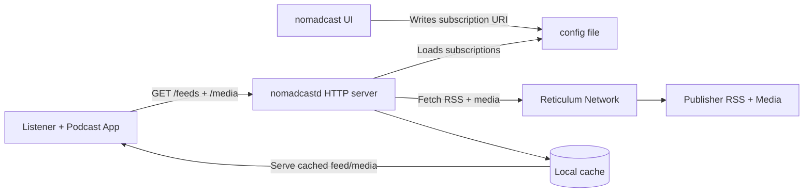

<p align="center">
  
</p>

<h1 align="center">NomadCast</h1>

<p align="center">
  
  
  
  
  
</p>

NomadCast is a friendly bridge between Reticulum-hosted podcasts and the podcast app you already love (Apple Podcasts, Overcast, Pocket Casts, etc.). It runs a tiny local service that looks like a normal HTTP podcast feed, while it quietly fetches the real RSS and audio over Reticulum behind the scenes.

In other words: you subscribe to a normal `localhost` URL, and your podcast app never needs to know Reticulum exists. NomadCast handles the magic for you.

## Contents

- [What a normal listener does](#what-a-normal-listener-does)
- [What a publisher does (v0, simplest path)](#what-a-publisher-does-v0-simplest-path)
- [Examples tour](#examples-tour)
- [Community conventions](#community-conventions)
- [How it works (more technical)](#how-it-works-more-technical)
- [Source code guide](#source-code-guide)
- [Protocol handler (nomadcast:)](#protocol-handler-nomadcast)
- [Installation notes (developer-oriented)](#installation-notes-developer-oriented)
- [Roadmap (future capabilities)](#roadmap-future-capabilities)
- [Related projects and references](#related-projects-and-references)

## What a normal listener does

Think of this like subscribing to any other podcast, just with one extra helper app.

1. Install NomadCast.
2. Start the NomadCast daemon (it runs quietly in the background).
3. Click a NomadCast podcast link on a NomadNet page; NomadCast pops up to confirm the add.
4. NomadCast adds the show to its config and launches your regular podcast player with a local URL like:
   - http://127.0.0.1:5050/feeds/<identity_hash:ShowName>

After that, your podcast app behaves normally: it sees an RSS feed, downloads episodes, and plays them. NomadCast keeps the feed and media available even when Reticulum is slow or offline by serving a local cache.

## What a publisher does (v0, simplest path)

NomadCast does not generate RSS for you. You publish a normal podcast RSS file and normal media files, and you host them on your existing Reticulum setup using Nomad Network, which already supports hosting pages and files.

If you want a concrete, copy-pastable reference, jump to the [examples tour](#examples-tour) for full sample files you can adapt.

### Publish steps (Nomad Network file hosting)

In your NomadNet page (or wherever you share the show), publish a normal-looking subscribe link that points to the NomadCast locator. This keeps the page clean and gives users one obvious action.

Example:

- [Subscribe to this podcast](nomadcast:a7c3e9b14f2d6a80715c9e3b1a4d8f20:BestPodcastInTheWorld/rss)

If you want a fallback for users who cannot click the link, include the raw locator on the next line:

- `nomadcast:a7c3e9b14f2d6a80715c9e3b1a4d8f20:BestPodcastInTheWorld/rss`

Notes:
- `\<destination_hash\>` is the publisher destination hash (32 hex chars) that listeners route to.
- The show name is cosmetic. The destination hash is authoritative.

Micron example (NomadNet-friendly):

```micron
## Subscribe

[Subscribe to this podcast](nomadcast:a7c3e9b14f2d6a80715c9e3b1a4d8f20%3ABestPodcastInTheWorld)

If that link does not open your podcast app, copy and paste that link into [NomadCast](https://github.com/jamesdwilson/nomadcast)
```

NomadCast installs itself as a system-wide protocol handler for `nomadcast://` links (and the shorter `nomadcast:` form), so clicking the link above will open NomadCast directly on supported systems.


1. Install Nomad Network:
   - pip install nomadnet

2. Run Nomad Network once to initialize your config:
   - nomadnet

3. Put your podcast RSS and media files into your node storage:
   - RSS: ~/.nomadnetwork/storage/files/\<YourShow\>/feed.rss
   - Media: ~/.nomadnetwork/storage/files/\<YourShow\>/media/<episode files>

   Notes:
   - Nomad Network nodes can host files. In NomadNet content, files are typically linked under a file/ path. See Nomad Network docs and community notes for file hosting conventions.
   - Keep your RSS a standard RSS 2.0 feed with `<enclosure>` URLs. NomadCast will rewrite those URLs for listeners.
   - If you want a starting point, the `examples/example.rss` file is ready to copy and rename.

4. In your NomadNet page (or wherever you share the show), publish a locator that includes your Reticulum identity hash plus a human-readable show name:
   - <identity_hash:YourShowName>

Listeners paste that string into NomadCast.

Publisher requirement: the identity hash must be stable. Use your existing NomadNet node identity (not a per-run random example identity) so the locator stays valid over time.

## Examples tour

If you learn best by example, there’s a small, cheerful sample podcast site in the `examples/` directory. You can open these files right now and adapt them for your own show:

- `examples/index.mu` — a rich NomadNet page with a subscribe button, episode summaries, and credits.
- `examples/example.rss` — a standard RSS 2.0 feed wired up to the sample episodes (with credit notes in the metadata).
- `examples/media/CCC - Reticulum - Unstoppable Networks for The People-smaller.mp3` — sample audio from a Chaos Communication Congress (CCC) community recording.
- `examples/media/Option Plus - How to fix the Internet – Nostr, Reticulum and other ideas.mp3` — sample audio referencing the Option Plus podcast.

Each file references the others so you can see the entire flow: NomadNet page → RSS feed → media. You can use these as a template, rename things to your show, and publish with confidence.

## Community conventions

NomadCast aims to follow Reticulum community norms for discoverability and publishing:

- Use Nomad Network file hosting paths (`/file/`) for RSS and media links when publishing on NomadNet pages.
- Treat the Reticulum identity hash as the canonical show identifier; the human-readable name is optional and cosmetic.
- Keep RSS feeds standard RSS 2.0 (and iTunes-compatible) so clients and tooling remain interoperable.

## How it works (more technical)

### Components

- nomadcastd (daemon)
  - Runs an HTTP server on 127.0.0.1:5050
  - Maintains a small local cache per show:
    - The most recent fetched RSS bytes
    - The last N episode media objects (default N=5, configurable)
  - Talks to Reticulum (Python RNS) to fetch:
    - The publisher RSS file
    - Episode media objects referenced by the RSS feed

- nomadcast (UI, v0)
  - A minimal Kivy prompt that collects a show locator and writes it to the daemon config.
  - After adding a show, it opens the local subscription URL in the OS (so your default podcast handler can take over).

### Data flow



1. You add a show locator:
   - <identity_hash:ShowName>

2. The daemon creates a local, stable feed URL:
   - http://127.0.0.1:5050/feeds/<identity_hash:ShowName>

3. Podcast app requests the feed:
   - GET /feeds/<identity_hash:ShowName>

4. The daemon responds immediately with cached RSS (if present) and triggers refresh in the background:
   - It fetches the authoritative RSS bytes from the publisher over Reticulum.
   - It stores the raw bytes.
   - It rewrites only the media URLs inside the RSS so enclosures point back to localhost.

5. Podcast app requests episode audio:
   - GET /media/<identity_hash:ShowName>/<episode_id_or_filename>

6. The daemon serves from local cache if available.
   - If not cached, it queues a Reticulum fetch.
   - Reticulum fetches are application-level requests over an established Link, delivered using Resource (or Bundle for larger payloads).
   - v0 behavior: it returns an HTTP error quickly (to keep the podcast app from hanging) while the episode is queued for retrieval.
   - When the fetch completes, the next attempt succeeds.

Reticulum transfer behavior (v0 expectations):
- Resource transfers are reliable while the Link stays up (packetization, sequencing, integrity checks, retransmits).
- Reticulum does not provide transparent "resume from byte offset" across a broken Link.
- NomadCast v0 retries from scratch if an episode transfer is interrupted.
- Future resume behavior, if desired, should be implemented at the application layer by chunking and deduplicating (for example via Bundle and chunk hashes).

### RSS rewriting rules (v0)

NomadCast is a pass-through for publisher-defined RSS. It does not redesign feeds or strip metadata.

It only rewrites:
- `<enclosure url="...">` and any other media URLs that point at the publisher’s Reticulum-hosted objects

Into:
- `http://127.0.0.1:5050/media/<identity_hash:ShowName>/<token>`

Everything else is preserved, byte-for-byte where feasible:
- title, description, GUID, pubDate, iTunes tags, chapters, artwork references, etc.

### Episode selection and cache policy (v0)

- NomadCast keeps the most recent N episodes per show in the local cache.
- Default N = 5.
- N is configurable per show in the daemon config.

The daemon will:
- Prefer the newest episodes by pubDate (or RSS ordering when pubDate is missing)
- Evict older cached episodes beyond N

### Port choice (v0)

- Default bind: 127.0.0.1:5050
- Rationale: common developer-local port, typically unprivileged, low collision with Reticulum tools.

## Source code guide

NomadCast is split into a UI package and a daemon package:

- `nomadcast/`: v0 UI and protocol handler entrypoint.
  - `__main__.py` handles CLI invocations (including protocol handler launches).
  - `ui.py` normalizes locators, writes subscriptions to the config, and launches the Kivy UI.
- `nomadcastd/`: the daemon implementation.
  - `daemon.py` orchestrates refreshes, queueing, cache management, and RSS rewrites.
  - `server.py` exposes the HTTP endpoints (`/feeds`, `/media`, `/reload`) and Range support.
  - `rss.py` parses RSS and rewrites enclosure URLs to localhost.
  - `parsing.py` validates `nomadcast:` locators and encodes/decodes show paths.
  - `storage.py` owns on-disk layout helpers and atomic writes.
  - `config.py` reads/writes the INI config format used by the daemon.
  - `fetchers.py` defines the Reticulum fetcher interface (with a mock for tests).

Tests live in `tests/` and focus on parsing, RSS rewriting, and HTTP range behavior.

## Protocol handler (nomadcast:)

NomadCast v0 registers a system URL protocol handler for the `nomadcast:` scheme.

Expectation:
- NomadNet users can click a `nomadcast:` link and NomadCast will open.
- NomadCast will add the subscription to the daemon config.
- NomadCast will then auto-launch the system `podcast://` handler to subscribe the user’s podcast app to the local feed URL.

Publisher-facing link format (what you put on a NomadNet page):

- [Subscribe to this podcast](nomadcast://a7c3e9b14f2d6a80715c9e3b1a4d8f20:BestPodcastInTheWorld/rss)

Both `nomadcast://` and the shorter `nomadcast:` form are accepted; use the double-slash form when you want a fully-qualified URL scheme in browsers.

Listener side behavior (v0):
1) Link click launches `nomadcast` with the full `nomadcast:...` URI as an argument.
2) `nomadcast` writes the subscription to config and triggers daemon reload.
3) `nomadcast` opens:

- podcast://127.0.0.1:5050/feeds/a7c3e9b14f2d6a80715c9e3b1a4d8f20%3ABestPodcastInTheWorld

Then `nomadcast` exits.

The installer (or package) configures the OS to route `nomadcast://` links to the NomadCast app, so any publisher-facing page can rely on the scheme opening NomadCast when it is installed.

## Installation notes (developer-oriented)

NomadCast is expected to track the Reticulum ecosystem’s Python-first gravity.

- Python daemon uses RNS.
- Minimal UI is Kivy.

See:
- Reticulum manual: https://markqvist.github.io/Reticulum/manual/
- Reticulum site mirror: https://reticulum.network/manual/
- Nomad Network: https://github.com/markqvist/NomadNet
- Kivy docs: https://kivy.org/doc/stable/

## Roadmap (future capabilities)

- Streaming attempt (best-effort):
  - If a fast uplink exists (eg WiFi/Ethernet encapsulation of Reticulum), attempt on-demand fetch and stream over HTTP to the podcast client.
  - Fall back to queue + retry semantics when the link cannot sustain streaming.

- Better publisher discovery:
  - Resolve human-friendly names to identities when naming systems in the ecosystem mature.
  - Optional index pages or manifests that NomadCast can consume.

- Richer caching logic:
  - Per-feed cache windows (hours/days) and per-episode retention policies.
  - Background refresh scheduling (eg “refresh every 6 hours when reachable”).
  - Smarter eviction based on storage pressure.

- Multiple publishing methods:
  - Additional “how to publish” patterns (beyond Nomad Network file hosting), as community conventions emerge.

- GUI expansion:
  - Manage daemon lifecycle, edit subscribed feeds, view cache status.
  - Optional system tray integration where supported.

- Health endpoint:
  - Add /health for local diagnostics and status.

## Related projects and references

- Reticulum (RNS): https://github.com/markqvist/Reticulum
- Reticulum manual: https://markqvist.github.io/Reticulum/manual/
- Nomad Network: https://github.com/markqvist/NomadNet
- Sideband (LXMF client with GUI): https://github.com/markqvist/Sideband
- MeshChat (web UI LXMF client): https://github.com/liamcottle/reticulum-meshchat
- rBrowser (NomadNet browser UI): https://github.com/fr33n0w/rBrowser
- Reticulum OpenAPI (community experiment): https://github.com/FreeTAKTeam/Reticulum_OpenAPI
- Kivy: https://kivy.org/doc/stable/
